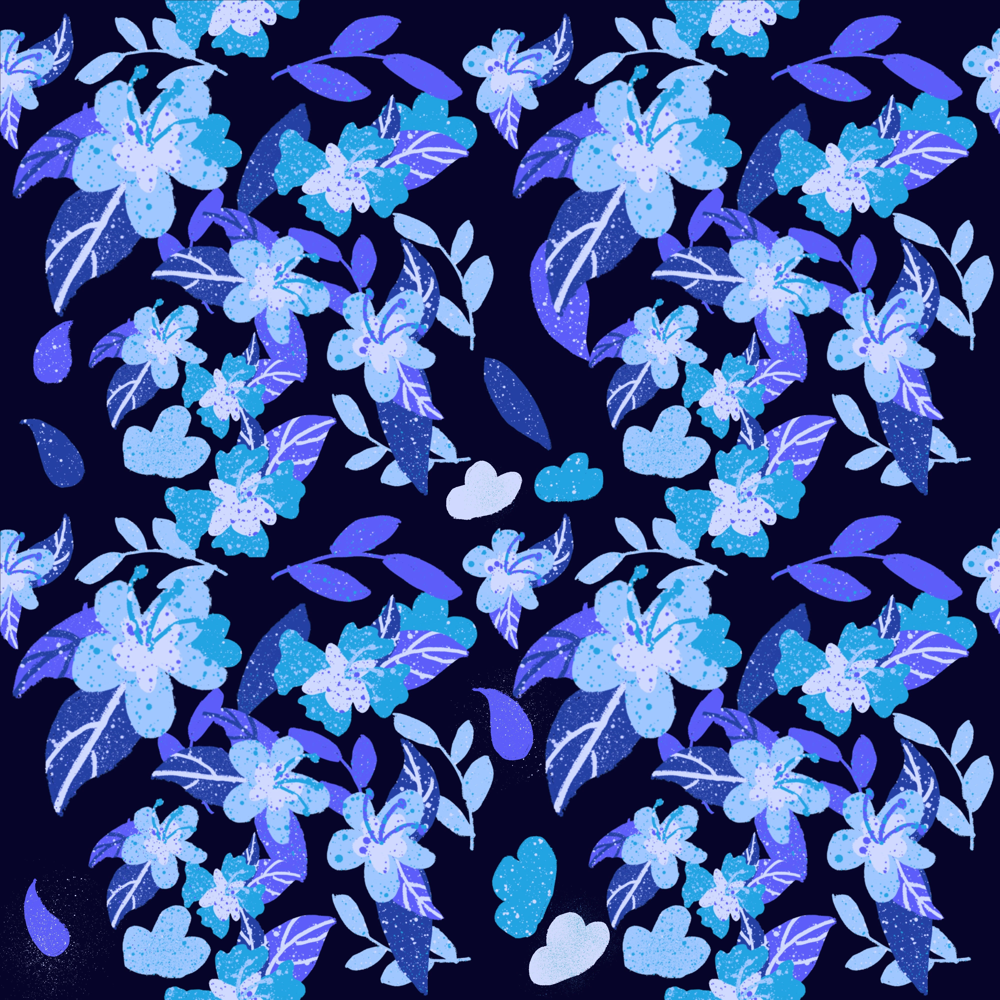

# Welcome to Michael's GitHub! 

 

 

Welcome! :wave: 

Coding is one my greatest passions. You can tell through the projects on my GitHub profile! Checkout some of my projects. 

When I'm not coding, I'm either working out in my local Crossfit Gym :metal: or cooking some trouble in the kitchen! 

## Pinned Projects 

- [Ravenous Project](https://github.com/mdwiltfong/Ravenous-Wiltfong.git)
- [Group Website Design Project](https://github.com/mdwiltfong/Group-Website-Design.git)

## Pinned Issues (Stuff I need help with!)

- [Target Issue With Badges](https://github.com/mdwiltfong/mdwiltfong/issues/1)
- [Nav Bar Design](https://github.com/mdwiltfong/mdwiltfong/issues/3)

## 

